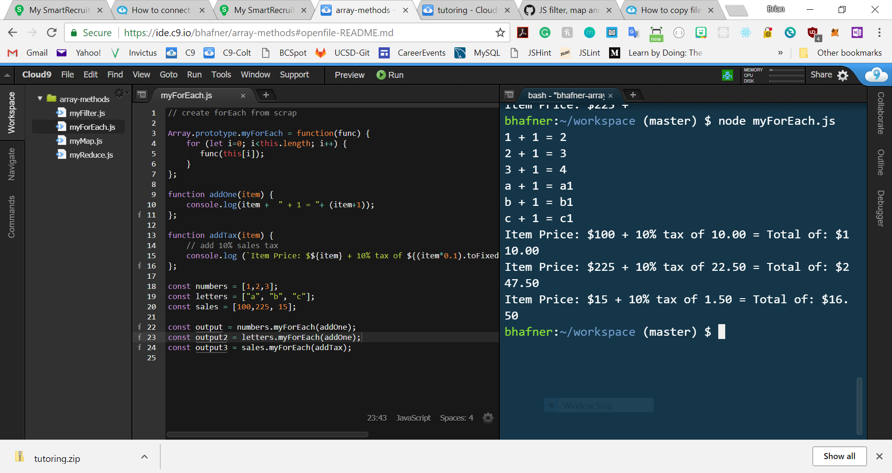

# Array Methods

I have my own versions of four Array methods: myForEach(), myMap(), myFilter(), and myReduce().

On my blog I have comments on how I made each method:
----------------------------------------------------
1. myForEach() - http://brianhafner.info/javascript-problems-create-my-own-version-of-foreach/
2. myMap() - http://brianhafner.info/javascript-problems-create-my-own-array-prototype-map-method-mymap/
3. myFilter() - http://brianhafner.info/javascript-problems-create-my-own-filter-method/
4. myReduce() - http://brianhafner.info/javascript-problems-create-my-own-reduce-method/

Screenshot for myForEach():
--------------------------

